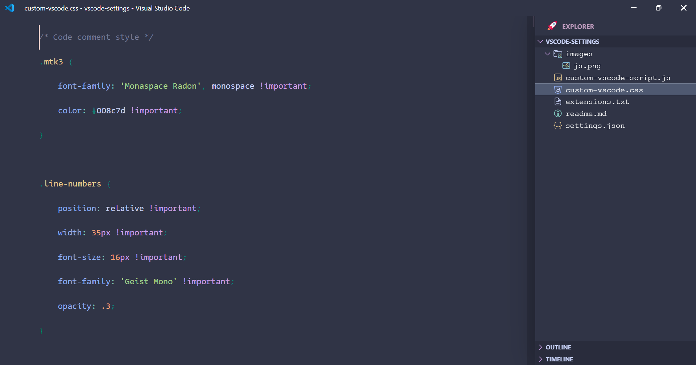
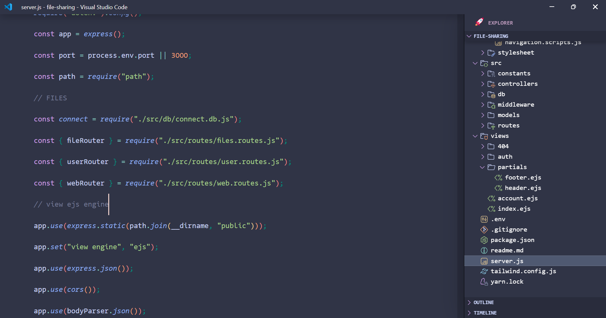
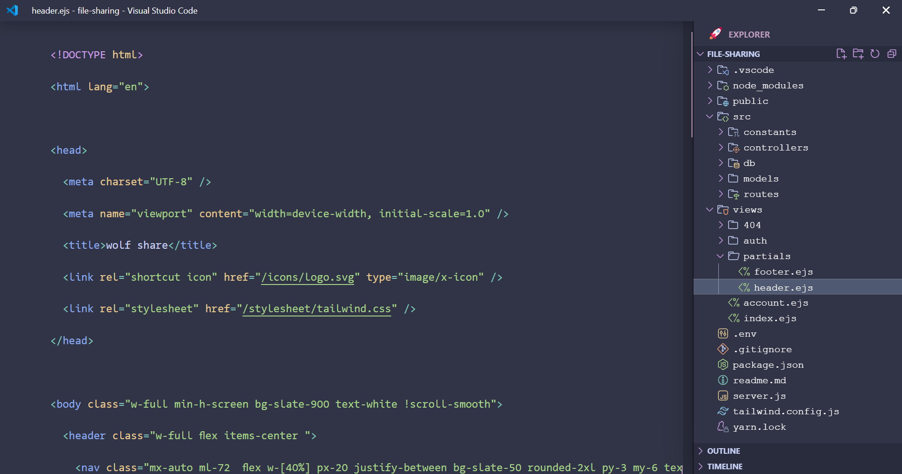

# vscode transformation

hi my friends this is my this is my vscode settings which is inspired from `glenn raya` [video link](https://youtu.be/9_I0bySQoCs?si=FjKMVt-W6Rof8xfy) & `josh cirre` [video link](https://youtu.be/uoqhrFRuRF4?si=ZieNSVQ3evvkisNr)

they transform vscode according by them but i made some changes in it like , we can use here `ctrl +x `, `ctrl + c` , without selecting here we just need place our cur cursor on that line.
and i add here `ctrl + click` option means we can open file just by this shortcuts on those file path

# css code

# js code

# html & ejs code

